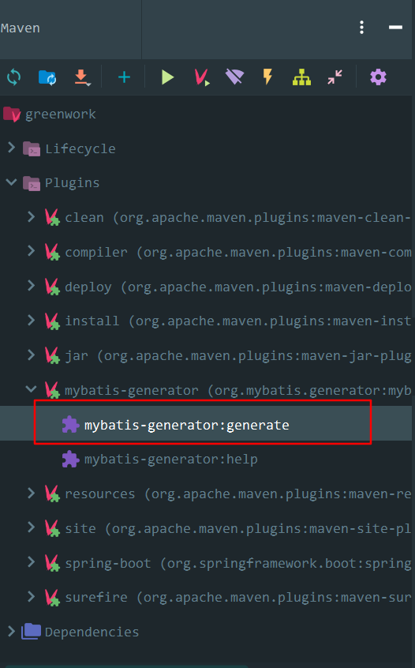

# 第八届中国软件杯《绿色车间》
## 来自深圳信息职业技术学院 
## 有点蒸汽团队 一位大一后端-曾楚龙的作品
## intro: 
## springboot整合mybatis逆向工程+redis缓存+swagger2接口文档
# 食用方法:
## 1、建立数据库，导入数据
### 在数据库中新建 greenwork 数据库，先运行resource.sql中的script.sql，再运行剩余的全部sql文件
## 2、application.yml配置文件
### 更改redis的ip地址和数据库ip地址，默认127.0.0.1为本地
## 3、mybatis逆向工程
### personal-generator.xml中填写mybatis逆向工程的相关配置，在左侧Maven菜单双击mybatis-generator:generate

## 4、banner.txt中可以自定义启动界面
### she.s my girl

## after:
# 12月12日是个特别的日子 人工湖的告白
## end:
# 希望日后的开发 有猫 有面包 有你
